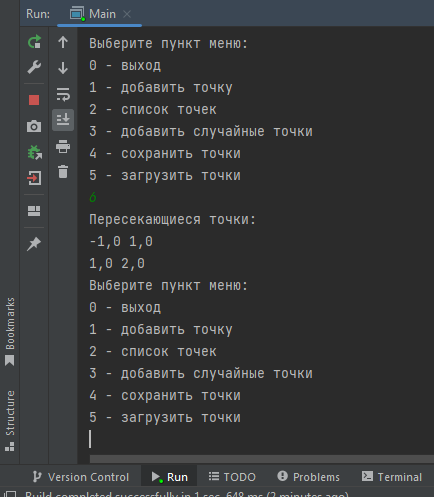

## Консольный геометрический проект

В этом репозитории лежит пример типового консольного проекта.

Он решает следующую задачу:

Заданы два множества точек в вещественном пространстве. Требуется построить пересечение
этих множеств.

